# Analysis of Survey Data

## Who Responded to the Survey?

Overall, a total of 82 people responded to the 2019 RocDev annual compensation survey.  Respondents spanned a wide range of educational backgrounds and professional experience. 

Most respondents had somewhere between 6 and 15 years of relevant work experience.

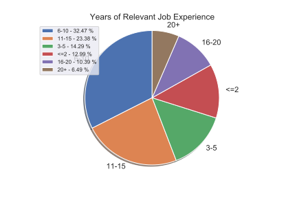 

The large majority of respondents held a bachelor's degree, while just under 20% held a master's.

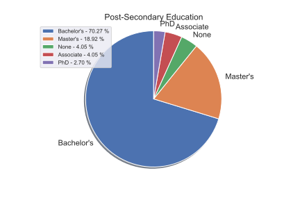

As is usually the case in the software development and technology industries, men outnumbered women by a significant margin.

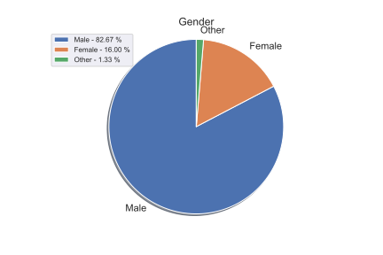 

The vast majority of respondents were employed in the private sector.  Just under half of respondents were employed by large, publicly traded companies (labeled as ownership by "Markets"), while half were employed by privately-held firms.  Of these, approximately half (~25% of the total) were employed by firms still controlled by their original founders.

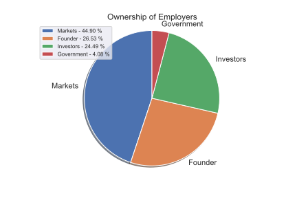

Approximately one third of respondents reported working remotely, while the remainder were employed by a company with a local office.

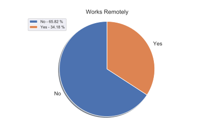 

The vast majority of respondents were engaged as full-time employees rather than as independent contractors.

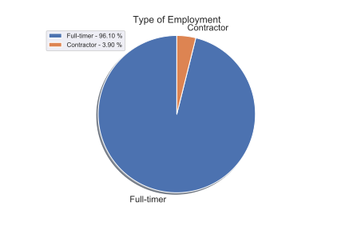

Most respondents were not responsible for supervising other employees.

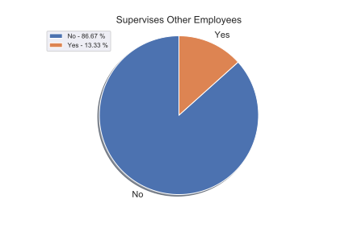

## What Was the Distribution of Compensation?

The average financial compensation for all respondents was approximately $110,000, and most fell in the range from $80,000 to $130,000 per year. Compensation was roughly normally distributed, but skewed towards the higher end.

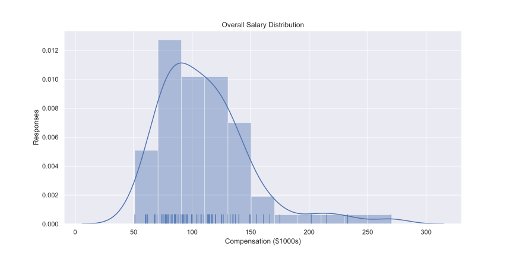

## How did Compensation Differ?

With only 82 respondents not always spread evenly across the different categories, reliable statistical inference is somewhat limited.  This data is presented as a series of [violin plots](https://en.wikipedia.org/wiki/Violin_plot).  Violin plots are designed to show how the distribution of compensation compares across several different categories.  These particular violin plots have the following properties:

- The total area of the violin is proportional to the number of respondents from that category.  For example, because only a few respondents worked for governments, the total size of that plot is considerably smaller than the others.
- The width of the violin at each vertical point corresponds to the estimated proportion of respondents at that level of compensation.
- The lines across each violin correspond to data quartiles, meaning that each segment between these lines represents the distribution of compensation for a quarter of the respondents.  The dashed line across the middle represents the median level of compensation for each group.
- The tops and bottoms of each estimate are usually more _pointy_, representing additional variability and uncertainty at the extremes of the distribution--the tails of the bell curve.  However, in these plots, these ends have been removed in favor of a clearer delineation of the total range.

In general, reported financial compensation was lowest in the public sector and the highest at large publicly traded companies.  Employees were paid slightly more at privately-held businesses still controlled by their founders rather than investors, though there's not enough data here to say whether or not this is just a coincidence.

Compensation at larger companies was higher on average, especially at the top end.

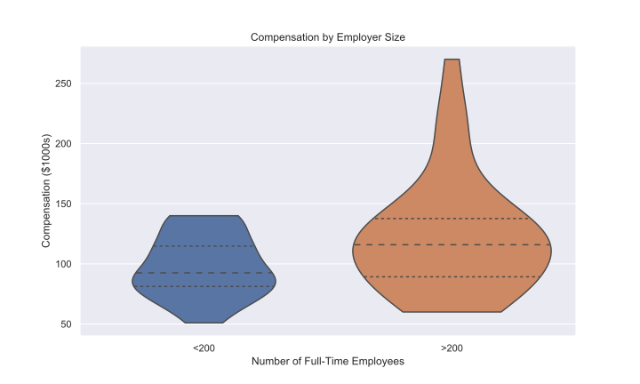

Compensation was generally higher for employees who worked remotely rather than for local employers. This is consistent with a lower cost of living in the Rochester area as compared with large metros (e.g., SF, NYC) where these remote employers were usually based.

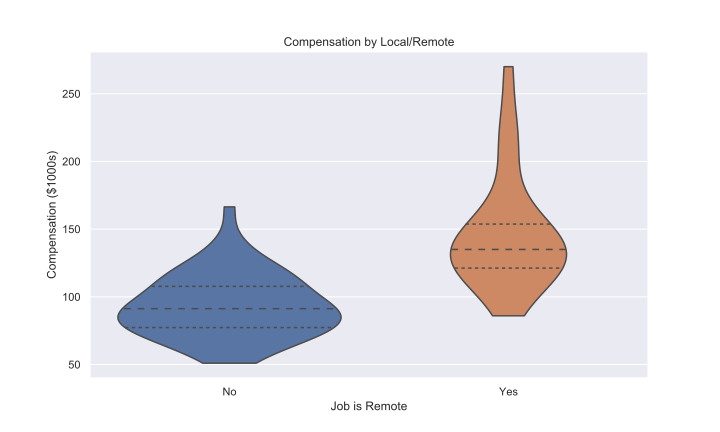

Overall, there was relatively little observed difference in financial compensation by education level.  The most notable feature here is that a master's degree is not associated with higher average compensation.

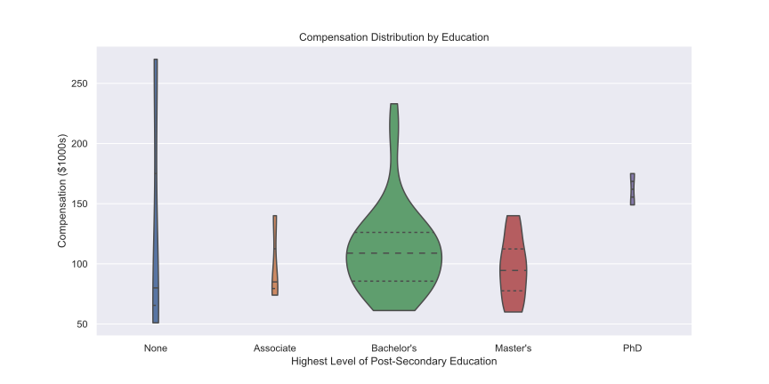

Unsurprisingly, compensation was lower for employees with less than two years of relevant professional experience.  While an individual's compensation does generally increases through their career, past the two year mark this effect could not be seen in the aggregate--likely overwhelmed by the variability in specific jobs among respondents.

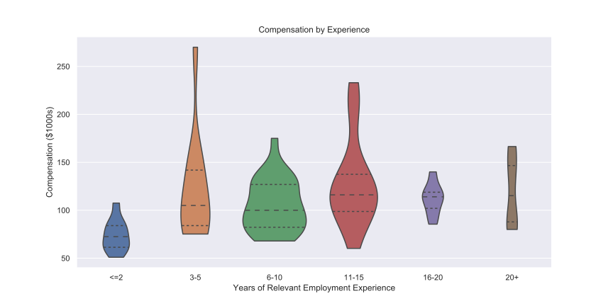

